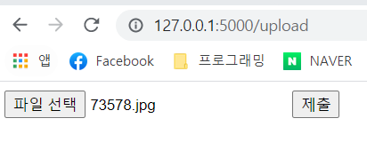
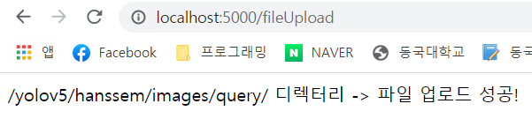
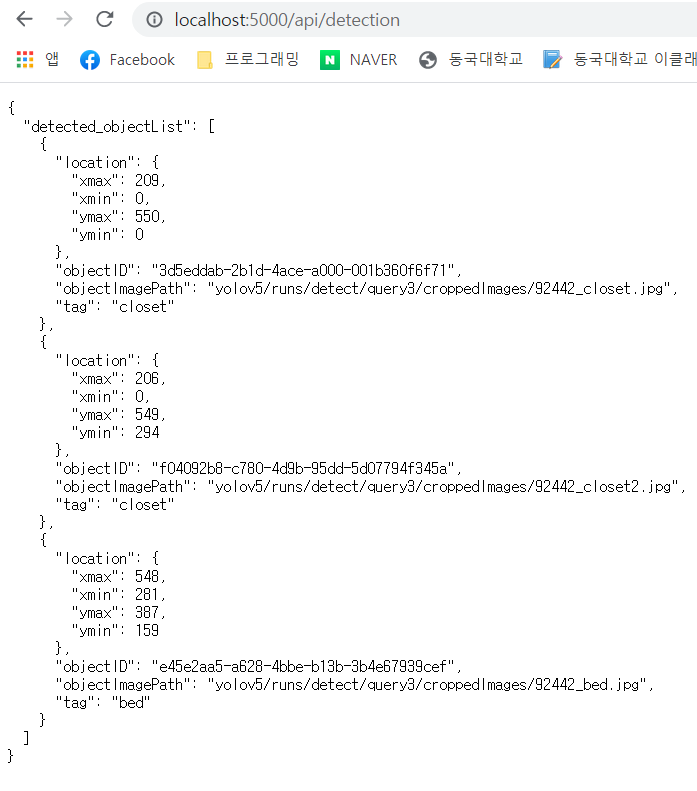
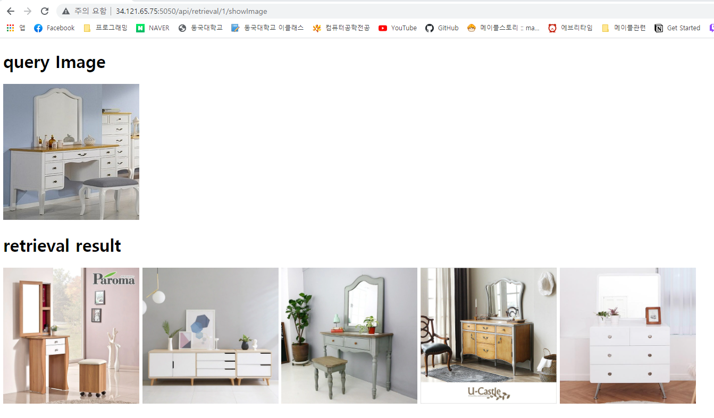

# Train
/integrated_main/yolov5에서 
- single GPU : python train.py --batch 64 --data hanssem.yaml --weights yolov5s.pt --device 0
- multi GPU : python -m torch.distributed.launch --nproc_per_node 2 train.py --batch 64 --data hanssem.yaml --weights yolov5s.pt --device 0,1

# 검색대상이 될 retrieval object pool 생성
- retrieval object pool은 검색을 수행하기 전에 미리 만들어놔야한다

# inference and retrieval
- inference.ipynb에서 실행

# API test 방법
사진은 port=5000에서 수행
 1. terminal에서 python apiMain.py
 2. model load : http://127.0.0.1:5050/ 로 들어가면 모델이 로드된다(4초) 
 3. 사진 업로드 : http://127.0.0.1:5050/upload에서 사진을 업로드하면 yolov5/hanssem/images/query/에 업로드됨
    - 사진업로드   
    
    - 업로드완료   
    

 4. 객체 탐지   : http://127.0.0.1:5050/api/detection에서 업로드된 사진에 detection을 수행하여 객체를 탐지하여 탐지된 객체를 json으로 반환한다   
 

 5. 이미지 검색 : http://127.0.0.1:5050/api/retrieval/0/showImage 으로 이미지 검색 수행. 여기서 /0/은 탐지한 객체를 선택하기 위한 index이다. 
 
 